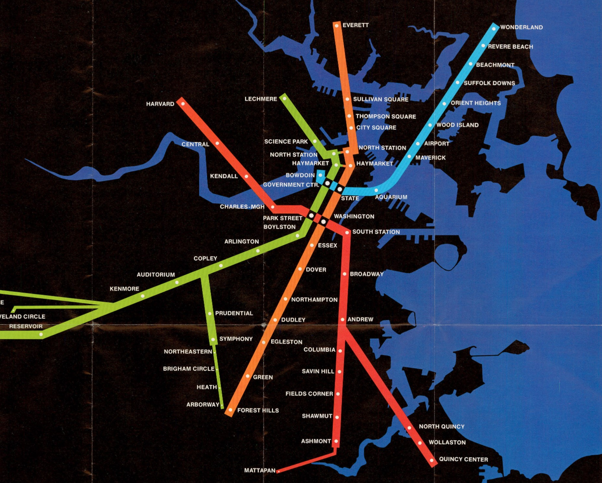
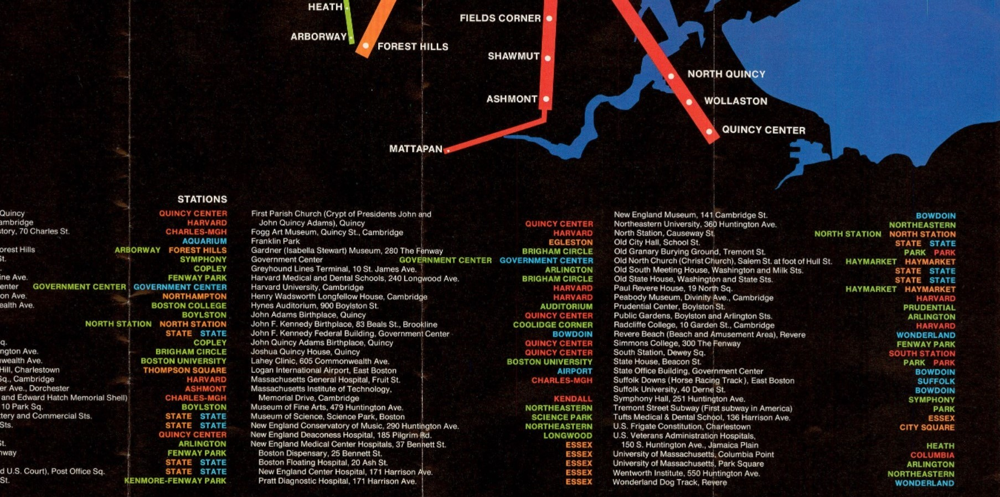

<!--
<h1 id="page-title" class="page__title" itemprop="headline">MSA25: INFRASTRUCTURE</h1> 		
-->

	
	

		INFRASTRUCTURE 
	

	

		MODERNIST STUDIES ASSOCIATION
	

	

		MSA 2025 BOSTON OCT 9-12
	

	<a href="special-events" class="btn1">EVENTS</a>
	<a href="CFP" class="btn2">CFP</a>
	<a href="program" class="btn3">PROGRAM</a>
	<a href="registration" class="btn4">REGISTRATION</a>
	<a href="travel" class="btn5">TRAVEL</a>
	<a href="seminars" class="btn6">SEMINARS</a>
	<a href="workshops" class="btn7">WORKSHOPS</a>
	<!--
	
	-->

<!--
<h1 style="color: black";>Boston, October 9-12, 2025</h1>
-->

<!--	

	

		<h1 id="page-title" class="page__title" itemprop="headline">       
		MSA2025: Boston       
		</h1> 
		
		

		
			

				  
				&emsp;For what to us were halls and corridors 
				&emsp;However large and fitting, if we part 
				&emsp;With this which is our birthright; if we lose 
				&emsp;A sentiment profound, unsoundable, 
				&emsp;Which Time's slow ripening alone can make, 
				&emsp;And man's blind foolishness so quickly mar. 
				&emsp;&emsp;&emsp;&mdash;Amy Lowell, from "Boston Athenæum"
			

		
 	
		 
	

-->