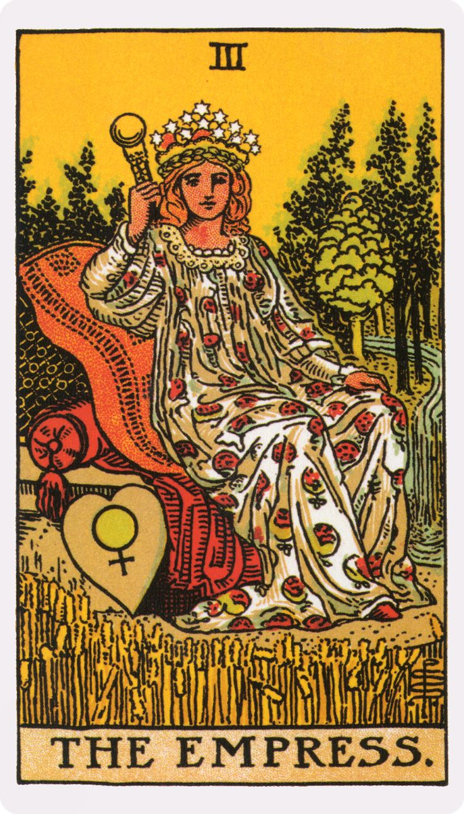
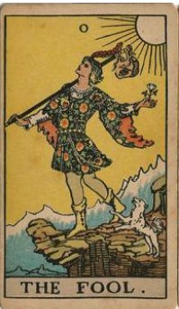
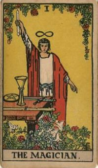
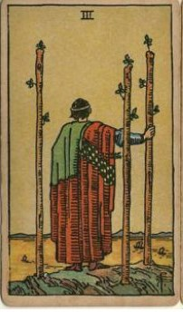
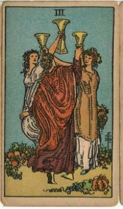
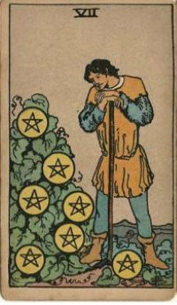

<head>
  <meta charset="UTF-8">
  <meta name="viewport" content="width=device-width, initial-scale=1.0">
 <link rel="preconnect" href="https://fonts.googleapis.com">
<link rel="preconnect" href="https://fonts.gstatic.com" crossorigin>
<link href="https://fonts.googleapis.com/css2?family=Sansita:ital,wght@0,400;0,700;0,800;0,900;1,400;1,700;1,800;1,900&display=swap" rel="stylesheet">
  <title>Image Disappear Animation</title>
  
</head>

	

<body>

<h1>
Weird Modernisms 
</h1>

  
  

	

		
	

	<figcaption  class="archive__item-title" style="font-size: 1rem; font-family: Sansita, cursive; font-weight: 700;">Loughborough University, UK July  1-4, 2026 Co-hosted by BAMS and MSA

</figcaption>
	<a href="conference/MSA2026/CFP/" class="click">CFP</a>

  

 

  
  

	
	
Loughborough University, UK

	
July 1-4, 2026,Co-hosted by BAMS and MSA

  

  
  

  Hidden Stuff 3
  

  
  

  Hidden Stuff 4
  

  
  

  Hidden Stuff 5
  

  
  

  Hidden Stuff 6
  

  
  

  Hidden Stuff 7
  

  
  

  Hidden Stuff 8
  

  
  

  Hidden Stuff 9
  

	
<!--

	
	

		

			
		

		<h3>Travel Grants</h3>
		<figcaption  class="archive__item-title">Applications for Travel Grants for MSA '25, Boston are now open.</figcaption>
		<a href="/members/travel-grants" class="btn btn--primary">Apply</a>
	

-->
	

</body>